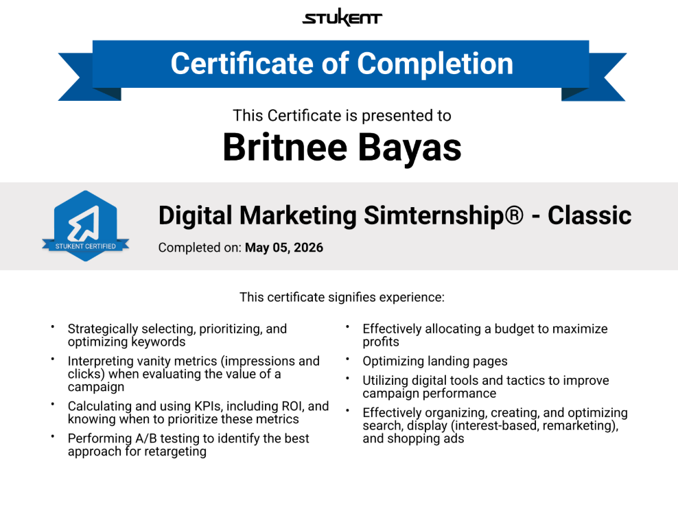

# 📊 Digital Marketing Simternship — Certificate Project
> *Campaign Management | KPI Tracking | Digital Advertising | Budget Optimization*

Completed the Stukent Digital Marketing Simternship (Classic), a hands-on simulation managing end-to-end digital advertising campaigns. Monitored KPIs, maintained reporting records, and optimized campaign performance through data analysis. Generated **$167,635 in total revenue** through strategic ad creation and performance-driven decision-making.

---

## 📌 Key Highlights
- Managed end-to-end digital advertising campaigns across search, display, and shopping ads
- Monitored and interpreted KPIs including ROI, impressions, and clicks to drive decisions
- Performed A/B testing to identify best retargeting approaches
- Optimized budget allocation across campaigns to maximize profitability
- Created and optimized landing pages to improve conversion rates
- Generated $167,635 in total revenue through strategic ad execution
- Completed May 05, 2026 — Stukent Certified

---

## 🛠️ Skills Demonstrated
- Strategically selecting, prioritizing, and optimizing keywords
- Interpreting vanity metrics (impressions and clicks) when evaluating campaign value
- Calculating and using KPIs including ROI, and knowing when to prioritize each metric
- Performing A/B testing to identify the best approach for retargeting
- Effectively allocating a budget to maximize profits
- Optimizing landing pages
- Utilizing digital tools and tactics to improve campaign performance
- Organizing, creating, and optimizing search, display, and shopping ads

---

## 🏅 Certificate of Completion

